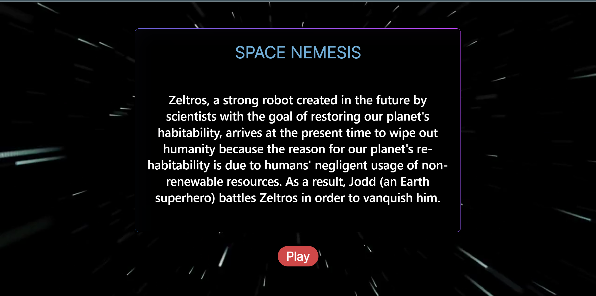
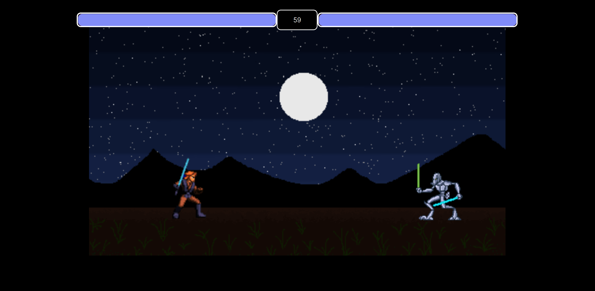
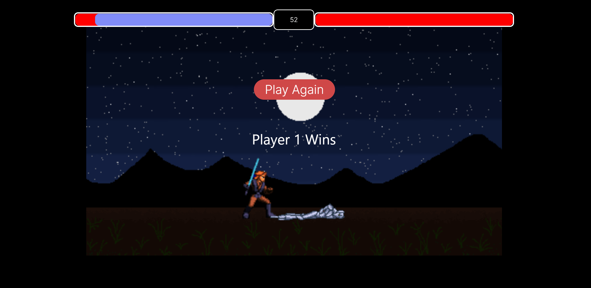

# Space-Nemesis
This a 1 versus 1 Game .
The story of the game is :

   (Zeltros, a strong robot created in the future by scientists with the goal of 
   restoring our planet's habitability, arrives at the present time to wipe out
   humanity because the reason for our planet's re-habitability is due to humans
   negligent usage of non-renewable resources. As a result, Jodd (an Earth superhero)
   battles Zeltros in order to vanquish him.)
 
 
 ScreenShots :
 
 
 
 
 
 Team Members : (Aryan Singh, Vedant Sawant , Rohit Ghosh)
 
 Languages used : (Html, Css , JavaScript )
 
 Credits :https://spritedatabase.net/
 
 
 
 
 
